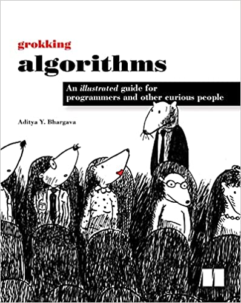

#Entendendo Algoritmos (Grokking Algorithms)
Resumo estruturado do livro "Entendendo Algoritmos - Um guia ilustrado para programadores e outros curiosos" de Aditya Y. Bhargava  
  
  

  Sumário
  * [Capítulo 01 - Busca binária e Big O]()
  * [Capítulo 02 - Ordenação por seleção]()
  * [Capítulo 03 - Recursão]()
  * [Capítulo 04 - Quicksort]()
  * [Capítulo 05 - Tabelas hash]()
  * [Capítulo 06 - Pesquisa em largura]()
  * [Capítulo 07 - Algoritmo de Dijkstra]()
  * [Capítulo 08 - Algoritmos gulosos]()
  * [Capítulo 09 - programação dinâmica]()
  * [Capítulo 10 - KNN]()
  * [Capítulo 11 - Próximos passos]()
